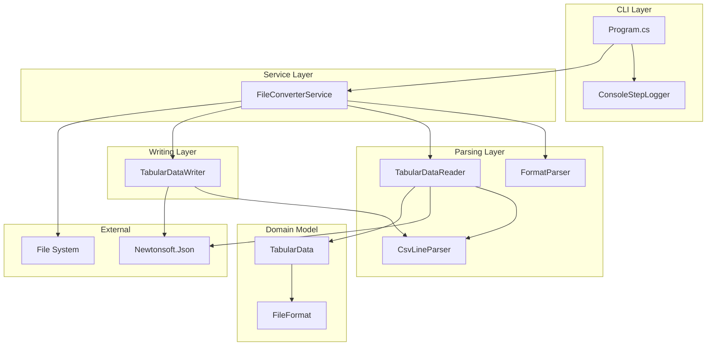
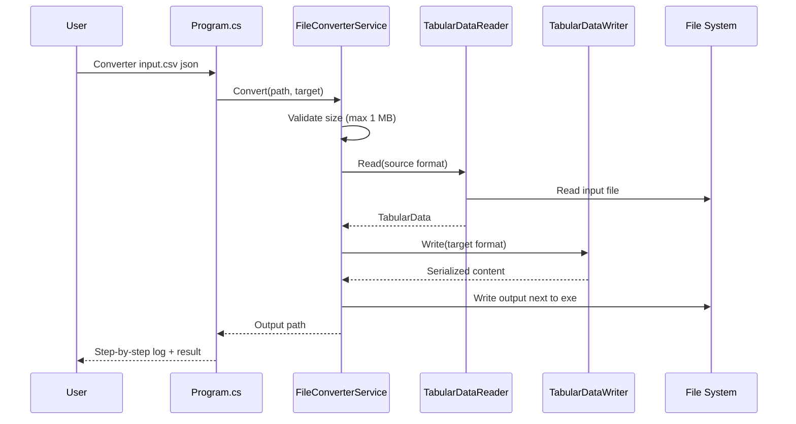

# File Format Converter

Command-line .NET 8 application that converts tabular data between **CSV**, **TXT** (tab-separated), and **JSON** formats.

## License

MIT — see [LICENSE](LICENSE).

## Architecture



### Conversion flow



## Requirements

- [.NET 8 SDK](https://dotnet.microsoft.com/download/dotnet/8.0) (LTS)
- Terminal (Windows, Linux, or macOS)

## Clone

```bash
git clone https://github.com/Slumper1122/Converter-project.git
cd Converter-project
```

## IDE settings

The repository includes `.editorconfig` for consistent formatting across Visual Studio, VS Code, and Rider.

| Setting | Value |
|---------|-------|
| Indentation | 4 spaces |
| Line endings | CRLF |
| Encoding | UTF-8 |

Open `Converter.slnx` in Visual Studio or use the [C# Dev Kit](https://marketplace.visualstudio.com/items?itemName=ms-dotnettools.csdevkit) extension in VS Code.

## Build

Single-file executable (framework-dependent):

```bash
dotnet publish Converter/Converter.csproj -c Release
```

Output (Windows):

```
Converter/bin/Release/net8.0/win-x64/publish/Converter.exe
```

## Usage

The program expects **2 arguments**: input file path and target format.

```bash
Converter.exe <input-file-path> <target-format>
```

Supported target formats: `csv`, `txt`, `json`

```bash
Converter.exe samples/sample.csv json
Converter.exe samples/sample.json txt
Converter.exe samples/sample.txt csv
```

### Behaviour

| Rule | Description |
|------|-------------|
| Input size | Maximum 1 MB |
| Output location | Next to the executable |
| Output name | Same base name as input, new extension |
| Overwrite | Existing output file is replaced |
| Invalid format | Throws `UnsupportedFormatException` |

### Terminal output

Each pipeline step is logged to the terminal:

```
[VALIDATE] Checking input arguments and file constraints.
[DETECT] Detecting source format from file extension.
[RESOLVE] Resolving target format.
[READ] Reading Csv content from 'sample.csv'.
[TRANSFORM] Converting Csv -> Json.
[WRITE] Writing output to '...\sample.json'.
[DONE] Conversion completed successfully (Csv -> Json).
[RESULT] Output file: ...\sample.json
```

## Tests

```bash
dotnet test Converter.slnx -c Release
```

Coverage is collected with **Coverlet**. The CI pipeline enforces a minimum of **60% branch coverage**.

| Test area | Examples |
|-----------|----------|
| Format conversions | CSV↔TXT↔JSON (all directions) |
| Error handling | Missing file, oversize file, invalid JSON |
| Format validation | Unsupported extensions and target formats |

## CI pipeline

GitHub Actions workflow: [`.github/workflows/ci.yml`](.github/workflows/ci.yml)

| Step | Action |
|------|--------|
| Trigger | `push`, `pull_request` to `main` |
| Checkout | `actions/checkout` |
| SDK setup | `actions/setup-dotnet` (matrix: 8, 9, 10) |
| Restore | `dotnet restore` |
| Build | `dotnet build` |
| Test | `dotnet test` + coverage collection |
| Coverage report | ReportGenerator + artifact upload |
| Threshold | Branch coverage ≥ 60% |
| Test results | `EnricoMi/publish-unit-test-result-action` |
| Publish smoke test | Windows job runs published `.exe` |

### Branch protection (repository admin)

Configure in GitHub **Settings → Branches → Branch protection rules** for `main`:

- Require pull request before merging
- Block direct pushes to `main`
- Dismiss stale pull request approvals when new commits are pushed

See [CONTRIBUTING.md](CONTRIBUTING.md) for the contributor workflow.

## Project structure

```
Converter-project/
├── .github/workflows/ci.yml
├── Converter/
│   ├── Program.cs
│   ├── Services/FileConverterService.cs
│   ├── Parsing/
│   ├── Writing/
│   ├── Models/
│   ├── Logging/
│   └── Exceptions/
├── Converter.Tests/
├── samples/
├── Converter.slnx
├── global.json
├── LICENSE
└── README.md
```

## Quick start

```bash
git clone https://github.com/Slumper1122/Converter-project.git
cd Converter-project
dotnet restore Converter.slnx
dotnet build Converter.slnx -c Release
dotnet test Converter.slnx -c Release
dotnet publish Converter/Converter.csproj -c Release
```

## Troubleshooting

| Failure | Likely cause | Fix |
|---------|--------------|-----|
| `dotnet restore` fails | Missing SDK or bad `.csproj` | Install .NET 8 SDK; verify package references |
| Build errors | Syntax or API mismatch | Run `dotnet build` locally and fix compiler errors |
| Tests fail | Logic regression | Run `dotnet test` and inspect failing test names |
| Coverage below 60% | Insufficient test paths | Add tests for uncovered branches |
| `UnsupportedFormatException` | Wrong extension or target | Use `.csv`/`.txt`/`.json` input and `csv`/`txt`/`json` target |
| CI fails on PR | Branch from outdated `main` | Rebase onto latest `main` and push again |
